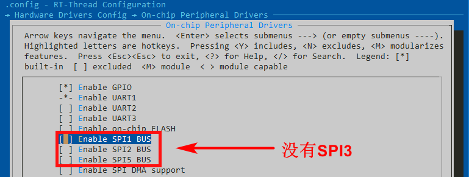
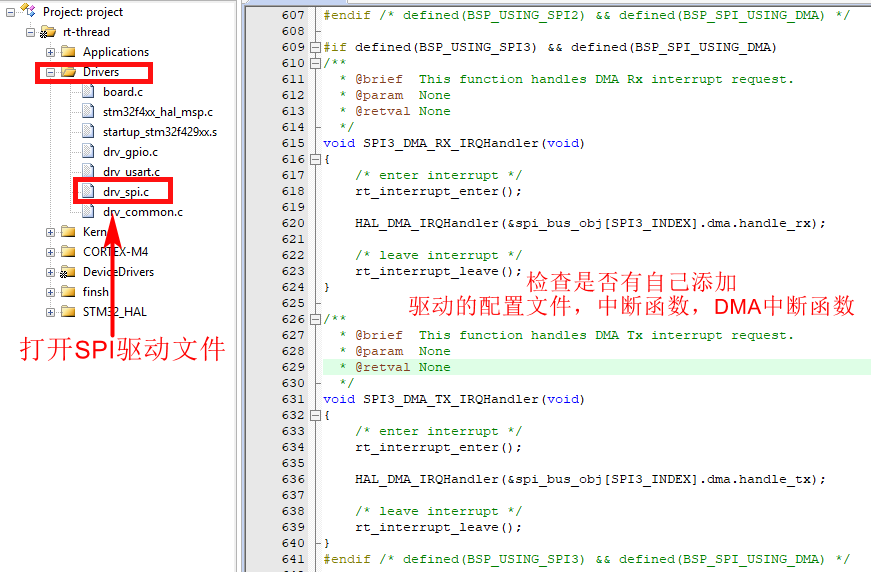

# STM32 系列外设驱动添加指南

## 1. 简介

本文档是为需要给现有的 STM32 BSP 添加更多外设驱动的开发者准备的。通过阅读本文，开发者可以按照自己的实际情况给现有 BSP 添加自己需要的驱动。

## 2. 前提要求

- 熟练使用 ENV 工具，参考：[RT-Thread env 工具用户手册](https://www.rt-thread.org/document/site/rtthread-development-guide/rtthread-tool-manual/env/env-user-manual/)
- 熟悉 Kconfig 语法
- 熟悉 STM32CubeMX 工具
- 对 RT-Thread 设备驱动框架有一定了解

## 3. 如何添加更多的外设驱动选项

本章节以添加片上外设驱动为例，讲解如何为 BSP 添加更多可用驱动。如果想使用的片上外设是 `片上外设配置菜单` 里没有的，就需要开发者自己添加了。下面我们将演示如何为 stm32f429-atk-apollo BSP 添加 SPI3 驱动。

> 没有安装 stm32cubemx 软件的可以访问 STM32cube中文网：<http://www.stm32cube.com/> ，在 `资源下载` 里下载 stm32cubemx 软件。

阿波罗 BSP 默认只支持 SPI1、SPI2 和 SPI5，是不支持 SPI3 的。开发者如果需要使用 SPI3，则需要自己添加。

添加 SPI3 的外设支持需要以下几步：

### 1）打开 STM32CubeMX 工程

打开 BSP 的 STM32CubeMX 配置文件。

### 2）按原理图配置 SPI3 的引脚，并生成代码

按图示顺序配置 SPI3，并生成代码。

> 为 BSP 添加驱动时，STM32CubeMX 工具可以快速的完成**使能外设**和**配置管脚**的工作。而外设初始化，中断配置，DMA配置等等则由 RT-Thread 提供的驱动文件来完成。也就是说，虽然 STM32CubeMX 生成了多个文件用来初始化外设，但 RT-Thread 只使用了 STM32CubeMX  生成的 `stm32fxx_hal_msp.c` 文件和 `stm32fxx_hal_conf.h` 文件。
>
> 对于不同的外设驱动，通过 STM32CubeMX 工具配置的内容也不一样。开发者可以参考本文档的附录 [CubeMX配置说明]() 章节来了解不同外设的配置方法。

### 3）修改 Kconfig 文件

打开 board 文件夹下的 Konfig 文件，拷贝 SPI2 的配置项，并重命名 SPI2 为 SPI3。

### 4）重新配置工程

经过上一步的修改，此时重新打开 ENV 工具，在 menuconfig 中就会出现添加的 SPI3 的配置项。

### 5）生成工程，检查驱动文件

使用 ENV 重新生成工程并打开，检查原有驱动文件是否支持新添加的驱动（查看是否有新驱动的配置文件，中断函数，DMA配置和中断函数等等），如不支持，需参考现有驱动添加相关的代码。

### 6）编译下载

检查完工程后，编译下载到开发板，程序会自动开始运行。输入 `list_device` 命令，可以看到 spi3 总线已经注册到内核，说明驱动已经添加成功。

## 4. 注意事项

- 部分驱动如果没有适配 BSP 所属的 STM32 系列，请等待 RT-Thread 团队更新。
  - 驱动文件对 STM32 系列的支持情况可以查看 [STM32系列驱动介绍文档](STM32系列驱动介绍文档.md)。
- 对于驱动文件或文档说明，有任何建议或者意见，欢迎反馈到 [RT_Thread GitHub](https://github.com/RT-Thread/rt-thread) 网站或 [RT-Thread 官方论坛](https://www.rt-thread.org/qa/forum.php)。

## 5. 附录

### 5.1 CubeMX配置说明

本小节介绍 stm32 系列的 BSP 是如何利用 CubeMX 工具对 BSP 进行配置的。

就像文档中提到的那样，stm32 系列的 BSP 只利用了  CubeMX 工具生成的  `stm32XXxx_hal_conf.h` 和 `stm32XXxx_hal_msp.c` 文件。在 HAL 库中， `stm32XXxx_hal_conf.h` 文件里提供的宏开关会决定 HAL 库将哪些外设驱动添加到工程中。 而`stm32XXxx_hal_msp.c` 文件中则存放了在 CubeMX 工具中开启的外设驱动的配置代码。

### 5.2 外设配置总结

当开发者想要在 BSP 中添加更多驱动时，需要使用 CubeMX 工具来配置这些外设。对于绝大多数驱动的配置，只需要在工具中使能相应的外设即可。但是对于一些复杂的外设，则需要更多的配置内容。下表展示了不同驱动在 CubeMX 工具配置步骤的总结：

| 序号 | 驱动     | CubeMx 工程中的配置情况（**加粗部分为必做步骤**）            |
| :--: | :------- | :----------------------------------------------------------- |
|  1   | GPIO     | 无需任何操作                                                 |
|  2   | UART     | **开启该外设** ，然后配置所需要的引脚（或者使用默认引脚）    |
|  3   | SPI      | **开启该外设** ，然后配置所需要的引脚（或者使用默认引脚）    |
|  4   | I2C      | 依赖于PIN 驱动，无需任何操作                                 |
|  5   | TIMER    | **使能 internal Clock 时钟**                                 |
|  7   | PWM      | **首先使能 internal Clock 时钟，然后为 channelx 选项选择PWM Generation CHx，** 最后配置所需要的引脚（或者使用默认引脚） |
|  8   | ADC      | **开启该外设，然后选择使用的通道**                           |
|  9   | RTC      | **开启该外设，然后在时钟树状图里将 RTC 选择为 LSE 时钟**     |
|  10  | Watchdog | **开启该外设**                                               |
|  11  | EMAC     | **配置 ETH 外设的工作模式（一般为 RMII 模式）**              |
|  12  | SDRAM    | **需要根据板载的 SDRAM 型号配置片选脚，地址线，数据线等**    |

